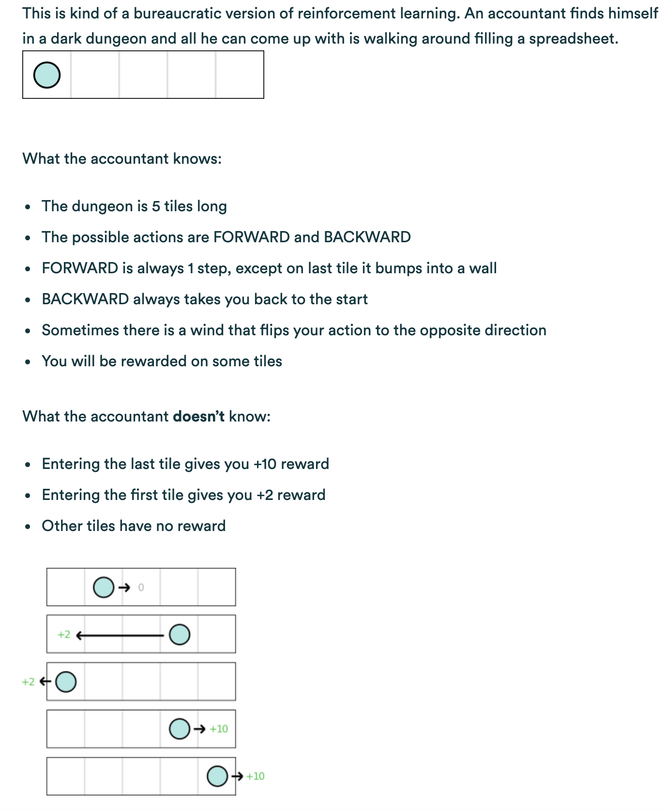

# Q-learning

## Toy Example

**RULES BELOW**

In brief, in this dark dungeon, there are 5 positions (*state space*). You have two options: forward one step or backward to start position (*action space*). Backward earns you 2 pts and forward to or start from last position earns you 10 pts (*reward*).

```eg_qlearning.py``` implements the basic Q-learning algorithm with $\varepsilon$-greedy action selection policy.

### How to run

```
python3 eg_qlearning.py
```
